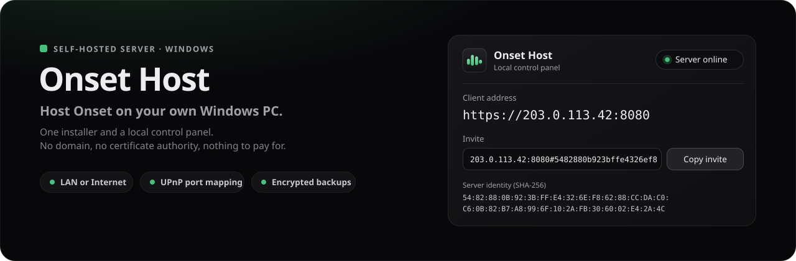
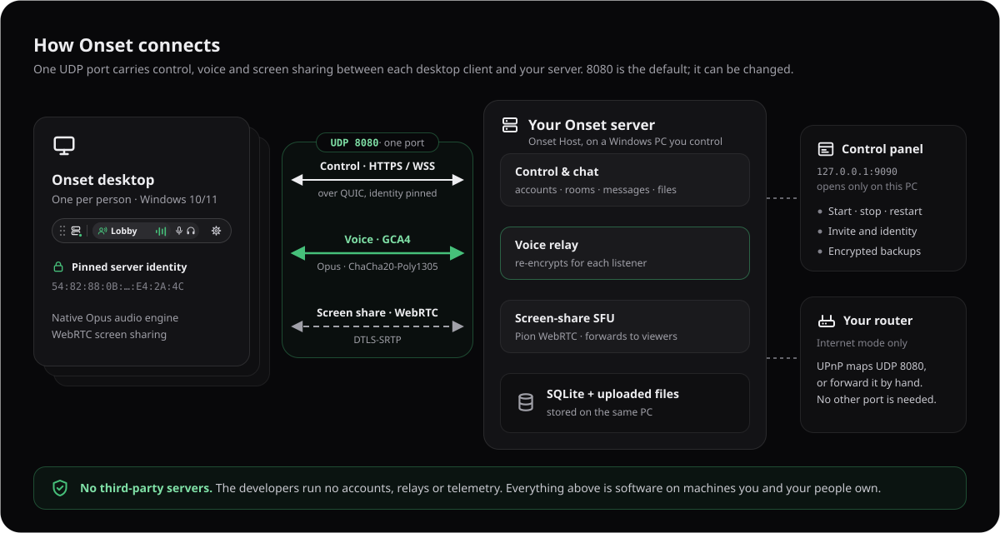

<p align="center">
  
</p>

<p align="center">
  <a href="https://github.com/firatkarakas/onset-host/releases/latest"><b>Download the latest release</b></a>
  &nbsp;·&nbsp;
  <a href="https://onsetvoice.com">Website</a>
  &nbsp;·&nbsp;
  <a href="https://github.com/firatkarakas/onset-client">Get the desktop app</a>
  &nbsp;·&nbsp;
  <a href="#ports-and-firewall">Ports</a>
  &nbsp;·&nbsp;
  <a href="#troubleshooting">Troubleshooting</a>
</p>

# Onset Host

Onset Host turns a Windows PC into a private server for [Onset](https://github.com/firatkarakas/onset-client): voice calls, text rooms, file sharing and screen sharing for your group. One installer sets up the server and a control panel that opens in your browser and is reachable only from that PC. You do not need a domain name, a certificate authority or a paid service. Each server creates its own identity, and the desktop app pins it.

This repository hosts the server installer and its release notes. Downloads are on the [Releases page](https://github.com/firatkarakas/onset-host/releases/latest).


## Contents

- [What you get](#what-you-get)
- [Requirements](#requirements)
- [Install](#install)
- [First start](#first-start)
- [The control panel](#the-control-panel)
- [LAN or Internet](#lan-or-internet)
- [Ports and firewall](#ports-and-firewall)
- [Server identity and invites](#server-identity-and-invites)
- [Backups and restore](#backups-and-restore)
- [Verify your download](#verify-your-download)
- [Updating](#updating)
- [Security and privacy](#security-and-privacy)
- [Troubleshooting](#troubleshooting)
- [Uninstall](#uninstall)
- [Support](#support)
- [License](#license)

## What you get

- **The server**: accounts, roles and moderation, persistent text rooms, direct messages, file storage, an encrypted voice relay (GCA4 over UDP) and a WebRTC forwarding unit (SFU) for screen sharing. Everything is reached on **one UDP port**. Data is stored in SQLite on the same PC.
- **A local control panel** at `http://127.0.0.1:9090`, opened by the **Onset Host** shortcut. Use it to start, stop and restart the server, choose LAN or Internet mode, set the port, manage the owner and invite tokens, choose the registration policy and message retention, turn call diagnostics on or off, start with Windows, read the server log and make encrypted backups on a schedule or on demand. It also shows the server's identity fingerprint and a ready-to-share invite.
- **Automatic router setup** in Internet mode. UPnP finds your public IPv4 address and maps the one UDP port. Manual port forwarding also works, and then the server finds your public address by itself.
- **Scheduled, encrypted backups** (`.gcb`, AES-GCM) with automatic pruning. The key is protected with Windows DPAPI, and you can export a recovery key.
- **Self-healing.** If the server process crashes, the panel restarts it with backoff, and stops trying (with a clear message) if it keeps crashing. Logs rotate on their own, and a restart tells connected apps to reconnect.
- **Version safety.** Apps older than this server are told to update instead of joining a call that cannot work.

<p align="center">
  
</p>

## Requirements

- Windows 10 or Windows 11, 64-bit (x64), and an administrator account to install.
- A PC that stays on while people use the server.
- **LAN mode**: the people connecting are on the same local network.
- **Internet mode**: a **public IPv4 address** on your router, plus a router with UPnP enabled or one where you can forward ports yourself. If your provider uses carrier-grade NAT (CGNAT), you cannot host directly. See [No public IPv4](#troubleshooting).
- Everyone connecting uses the Onset desktop app **1.0.5 or newer** ([download](https://github.com/firatkarakas/onset-client/releases/latest)). Older apps are told to update; the app updates itself.

## Install

1. Open the [latest release](https://github.com/firatkarakas/onset-host/releases/latest) and download `Onset-Host-<version>-x64.msi` and `SHA256SUMS`.
2. Optional, but a good idea: [check the file's hash](#verify-your-download).
3. Run the MSI and approve the administrator prompt. The installer is not signed with a paid code-signing certificate, so SmartScreen may show **Windows protected your PC**. After you have checked the hash, choose **More info**, then **Run anyway**.
4. The installer puts the server in `C:\Program Files\Onset Host`, adds **Onset Host** shortcuts to the desktop and Start menu, and adds Windows Firewall rules that let devices on your local subnet reach the server on Private and Domain networks.

## First start

<p align="center">
  
</p>

1. **Open the shortcut.** It starts the server in the background and opens the control panel in your browser. The server begins in **LAN mode**, with invite-only registration and history kept indefinitely. Opening the shortcut again just reopens the panel.
2. **Create the owner account.** Install the [desktop app](https://github.com/firatkarakas/onset-client/releases/latest), click **Copy invite** in the panel and paste the invite into the app's **Server address**. Choose **Register a new account**, then paste the **First owner setup token** from the panel into the **Bootstrap token** field. The first account created becomes the server **owner**.
3. **Invite people.** Send them the **invite** and the **invite token**. Each person pastes the invite into Server address, chooses **Register a new account** and pastes the invite token into **Bootstrap token**.
4. **Opening to the internet?** Switch **Reach** to **Internet** and choose **Save and restart**. The panel then shows the public address and an updated invite. Send that one to people outside your network.

## The control panel

<p align="center">
  
</p>

The panel listens only on `127.0.0.1:9090`, so no other device can open it. Changes take effect with **Save and restart**, which briefly interrupts calls if the server is running.

| Setting | What it does |
| --- | --- |
| **Reach** | *This network (LAN)* serves devices on your private network. *Internet* also accepts people from outside it. |
| **Public IPv4** | Leave it empty: UPnP fills it in, and without UPnP the server finds it by itself and checks it every ten minutes. An address you type always wins. |
| **Port (UDP)** | Default 8080. Sign-in, chat, files, voice and screen sharing all use this UDP port, and the invite names it. The server also listens on the same number over TCP, for the panel and to tell outdated apps to update. |
| **Set up my router automatically with UPnP** | Maps the UDP port on your router in Internet mode, and the TCP port of the same number, which tells outdated apps to update. |
| **Registration** | *Invite token* (default): new accounts need the invite token. *Closed*: nobody new can register. *Open*: anyone who can reach the server can register. |
| **Delete history after days** | `0` (default) keeps history until users delete it. Any other number deletes older messages automatically. |
| **Backup folder** | Optional absolute path, for example another drive or a network share. If left empty, backups go to the `backups` folder in the server's data folder. |
| **First owner setup token** / **Invite token** | Copy buttons for the two registration secrets. |
| **Keep call diagnostics** | Lets connected apps report call-quality statistics to this server. Turn it off to stop collecting them. |
| **Start with Windows** | Starts the server in the background when you sign in to Windows. |

## LAN or Internet

**LAN mode** accepts connections from your local network only. Traffic is still encrypted with the server's own identity. You do not need to change anything on your router.

**Internet mode** makes the server reachable at your public IPv4 address:

- With **UPnP** on (the default), the server finds your public address and maps the UDP port on your router, plus the TCP port of the same number, which only tells outdated apps to update. The mappings last one hour and is renewed every 20 minutes while the server runs. Existing mappings that belong to another device are never overwritten; the panel reports the conflict instead.
- Without UPnP, forward the UDP port (8080 by default) to this PC yourself; behind two routers, forward it on both. Leave **Public IPv4** empty and the server finds your public address by itself: it asks the project's website (`onsetvoice.com`, served by Cloudflare) which address the request came from, at start and every ten minutes. Nothing else is sent. If the address changes, screen sharing follows it without a restart.
- Changing **Reach** or **Set up my router automatically with UPnP** takes effect at once; the server restarts with the new choice.
- The first time you start in Internet mode, Windows asks for administrator approval to add a firewall rule that accepts connections from outside your local subnet. That rule is removed when you switch back to LAN mode (again with approval) or uninstall.
- CGNAT: if your router's internet-facing address is private or in `100.64.0.0/10`, people outside your network cannot reach you directly, and the panel says so.

## Ports and firewall

<p align="center">
  
</p>

| Port (default) | Protocol | Used for | Forward in Internet mode? |
| --- | --- | --- | --- |
| `8080` | UDP | Everything the app does: sign-in, chat and files (HTTPS and WSS over QUIC), encrypted voice (GCA4), screen sharing (WebRTC, DTLS-SRTP) | **Yes** |
| `8080` | TCP | The control panel's own calls, and telling apps older than 1.0.5 to update | Optional |
| `9090` | TCP | Control panel, `127.0.0.1` only | **No, never** |

No other ports are needed. Forwarding TCP 8080 as well is harmless: an app that has not updated yet then shows *update the app* instead of failing to connect. Onset does not need port 80 and does not request certificates from anyone.

**Windows Firewall.** The installer allows the server program on **Private** and **Domain** networks from your local subnet. If LAN devices cannot connect, check that the server PC's network profile is **Private** (**Settings → Network & internet → your connection → Network profile type**). Internet mode adds a separate rule after administrator approval, as described above.

## Server identity and invites

- On first start, the server creates a long-lived, self-signed certificate. This is its **identity**. The panel shows the SHA-256 fingerprint as **Server identity (SHA-256)**.
- **Copy invite** produces `host:port#<64-hex fingerprint>`. The desktop app connects to `host:port` and accepts only a server with exactly that fingerprint, so even the first connection cannot be quietly intercepted. People who type only `host:port` pin the identity the first time they connect (trust on first use). They can compare it with your panel.
- **Keep the identity safe.** It lives in the `certificates` folder of the server's data folder and is included in every backup. If it is lost and a new one is generated, every app that connected before will refuse to connect and show *"This server's identity changed"*, along with the old and new fingerprints. Restore the identity from a backup to avoid this. If you really did start over, share the new invite so people can confirm the new fingerprint before trusting it.

## Backups and restore

The panel makes **scheduled backups** — daily at 04:00 by default, or weekly, or off — and keeps the newest 14 (both adjustable under **Access and data**). **Create backup** makes one right away. Each run writes an encrypted archive (`onset-<date>-<time>-….gcb`) to the backup folder with the settings, the database and uploaded files, and the server identity. The server keeps running: it takes a consistent snapshot of its databases while calls and chat continue, so nobody is disconnected. A missed scheduled backup runs once when the panel next starts. Point the backup folder at another drive or a network share so a disk failure does not take the backups with it.

Archives are encrypted with AES-GCM. The key is stored as `backup-key.dpapi` in the server's data folder, protected by Windows DPAPI for your Windows user, and is never placed inside an archive. **After your first backup, export a recovery key**, or the archives can be opened only by the same Windows user on the same PC:

```powershell
# Export the recovery key (never overwrites an existing file)
& "$env:ProgramFiles\Onset Host\onset-host.exe" --export-backup-key 'E:\OfflineRecovery\onset-recovery.key'

# Decrypt an archive as the same Windows user
& "$env:ProgramFiles\Onset Host\onset-host.exe" --decrypt-backup 'D:\Backups\backup.gcb' 'D:\Restore\backup.zip'

# Decrypt on another PC or as another user
& "$env:ProgramFiles\Onset Host\onset-host.exe" --decrypt-backup 'D:\Backups\backup.gcb' 'D:\Restore\backup.zip' --recovery-key 'E:\OfflineRecovery\onset-recovery.key'
```

The exported `.key` file is a plain secret, and so is a decrypted ZIP. Store the key offline or on an encrypted drive, **not** next to the archives.

**To restore:** stop the server in the panel, then end `onset-host.exe` in Task Manager (the server process stops with it). Decrypt the archive and copy its `settings.json`, `data` and `certificates` into `%LOCALAPPDATA%\Onset Host`, replacing the existing ones. Then open the shortcut again. Because the identity is restored, people's apps keep trusting the server.

**Where data lives:** `%LOCALAPPDATA%\Onset Host` holds `settings.json`, `data\` (database and uploads), `certificates\` (identity), `backups\` (when no backup folder is set), `server.log` and `manager.log`.

## Verify your download

Each release includes a `SHA256SUMS` file. In PowerShell, from the folder you downloaded to:

```powershell
$file = 'Onset-Host-1.0.0-x64.msi'   # the file you downloaded
$expected = (Select-String -Path .\SHA256SUMS -Pattern ([regex]::Escape($file) + '$')).Line.Split(' ')[0]
$actual = (Get-FileHash ".\$file" -Algorithm SHA256).Hash
if ($actual -eq $expected) { 'OK: the hash matches' } else { 'MISMATCH: do not install this file' }
```

Or run `Get-FileHash .\Onset-Host-1.0.0-x64.msi -Algorithm SHA256` and compare the result with the matching line in `SHA256SUMS` yourself (upper and lower case do not matter). The hash confirms that your download matches the published file. It does not replace a code-signing certificate, which this project does not have.

## Updating

- The server does not update itself. To upgrade, download the newer MSI and run it. It replaces the installed version and keeps your data, identity and settings in `%LOCALAPPDATA%\Onset Host`. As a precaution, create a backup first.
- **Upgrading from 1.0.1 or earlier.** The server now uses one UDP port instead of TCP 8080, UDP 9000 and UDP 9001. Your control port number (8080 by default) becomes that port, so invites you already sent keep working. With UPnP the router is updated for you, and the old UDP 9000 and 9001 mappings are removed. If you forward ports by hand, forward **UDP 8080** (on both routers if there are two); the UDP 9000 and 9001 forwards are no longer needed. Everyone needs Onset 1.0.5 or newer; older apps are told to update.

## Security and privacy

- **Nothing is hosted by the developers.** There is no central service, relay or account system. The server runs entirely on your PC, and the apps connect to it directly.
- **Encrypted connections.** The control channel is always HTTPS/WSS over QUIC (TLS 1.3), secured by the server's pinned identity, in both LAN and Internet mode. Voice uses GCA4 (ChaCha20-Poly1305, keys for each session, replay protection), and the relay re-encrypts each packet for each listener. Screen sharing uses WebRTC's DTLS-SRTP.
- **You hold the data.** Messages, files and accounts are stored on your PC. As the operator you can technically access them, because this is not end-to-end encryption. Tell your users so.
- **Accounts.** Passwords are stored as bcrypt hashes. Sessions use short-lived access tokens and rotating refresh tokens.
- **Call diagnostics** (packet counts, buffer depth, loss, device names, app version) are sent by connected apps to *your* server only, and stored in a separate database on it. They never include audio, video, message text or file names. Untick **Keep call diagnostics** to stop collecting them.
- **Logs.** The server log does not contain passwords or message contents.

## Troubleshooting

<details>
<summary><b>Windows SmartScreen says "Windows protected your PC"</b></summary>

The MSI is not Authenticode-signed, because the project does not buy a code-signing certificate, and new releases have no SmartScreen reputation yet. [Verify the hash](#verify-your-download), then choose **More info → Run anyway**.
</details>

<details>
<summary><b>"Automatic router setup failed"</b></summary>

Your router did not answer UPnP. Turn on UPnP in the router's settings, or turn off **Set up my router automatically with UPnP** and forward UDP 8080 (or your chosen port) to this PC's LAN address. The server finds your public address by itself.

If the panel says your router is behind another router, UPnP can open the port only on the inner one. Turn UPnP off and forward the port on the modem that connects to the internet, and on the inner router too.
</details>

<details>
<summary><b>"… is already mapped by another application"</b></summary>

Another device or program already holds that port on your router. Choose a different port in the panel, or remove the old mapping in the router's settings.
</details>

<details>
<summary><b>No public IPv4 (CGNAT)</b></summary>

If the panel reports *"the router has no public IPv4 address"*, your internet provider shares one public address among many customers (carrier-grade NAT). People outside your network cannot reach the server directly. Ask your provider for a public IPv4 address, or use LAN mode. Onset does not include a relay service.
</details>

<details>
<summary><b>People on my network cannot connect</b></summary>

- Use the invite from the panel. It contains the right address and port.
- Make sure the Windows network profile is **Private**. The installer's firewall rule does not apply on Public networks.
- Check that the panel shows **Server online**, and read the **Server log** for errors.
</details>

<details>
<summary><b>The app says the server "answered over TCP only" or "needs UDP port 8080"</b></summary>

The app reaches the server over UDP, and only the TCP port answered. Forward the port for **UDP**, not only TCP, to this PC's LAN address (on both routers if there are two), and check that nothing else on the router holds UDP 8080. A firewall or network that blocks UDP altogether, as some workplace networks do, cannot reach the server.
</details>

<details>
<summary><b>People outside my network cannot see screen shares</b></summary>

Screen sharing tells viewers your public address. Use **Internet** mode for people outside your network: the panel then shows the public address it found or the one you typed. In LAN mode the server offers only its local address. Also check that everyone runs Onset 1.0.5 or newer.
</details>

<details>
<summary><b>People see "This server's identity changed"</b></summary>

The server is presenting a new identity, usually because the `certificates` folder was deleted or the server was reinstalled without restoring a backup. Restore `certificates` from your latest backup and restart. If that is not possible, send everyone the new invite and let them compare fingerprints before choosing **Trust the new identity**.
</details>

<details>
<summary><b>Start fails with "Windows firewall setup needs administrator approval"</b></summary>

Internet mode needs a firewall rule, and the approval prompt was declined. Choose **Start** again and approve the prompt, or switch back to LAN mode.
</details>

<details>
<summary><b>How do I stop the server completely?</b></summary>

Choose **Stop** in the panel. The control panel process keeps running in the background so you can start the server again. To stop everything, end `onset-host.exe` in Task Manager, and untick **Start with Windows** if you do not want it back at the next sign-in.
</details>

## Uninstall

Open **Settings → Apps → Installed apps**, find **Onset Host** and choose **Uninstall**. The uninstaller stops the server, removes its **Start with Windows** entry and the Internet-mode firewall rule, and deletes the program files. Your data in `%LOCALAPPDATA%\Onset Host` (database, uploads, identity, settings, backups stored there) is **kept**, so a reinstall keeps the same identity. Delete that folder yourself to remove everything, after taking a backup if you might need it. Router mappings made with UPnP use a one-hour lease and normally expire on their own; ports you forwarded by hand stay until you remove them in the router.

## Support

Email **support@onsetvoice.com**, or report a bug on the [issue tracker](https://github.com/firatkarakas/onset-client/issues). Please include your Onset Host version (**Settings → Apps → Installed apps**) and the relevant lines from the panel's **Server log**. The log holds no passwords and no message contents, but it shows IP addresses and user names, so look it over before you send it.

## Related

- **[Onset for Windows](https://github.com/firatkarakas/onset-client)**: the desktop app your people use to connect.
- **[Releases](https://github.com/firatkarakas/onset-host/releases)**: every server version, with release notes and checksums.

## License

This version of Onset Host is freeware: free to use, and you may share unmodified copies of the official installer as long as you charge nothing for them. The license applies to the version it ships with. Later versions may be offered under different terms, and the names and logo are not licensed. © Fırat Karakaş. All rights reserved. The full terms, including the warranty disclaimer, are in [LICENSE.txt](LICENSE.txt).

Onset Host is built on open-source components. Their licenses and full license texts are in `THIRD-PARTY-NOTICES.md`, which is installed next to the program and attached to every release.

This repository contains release files only. The source code is not published here.
